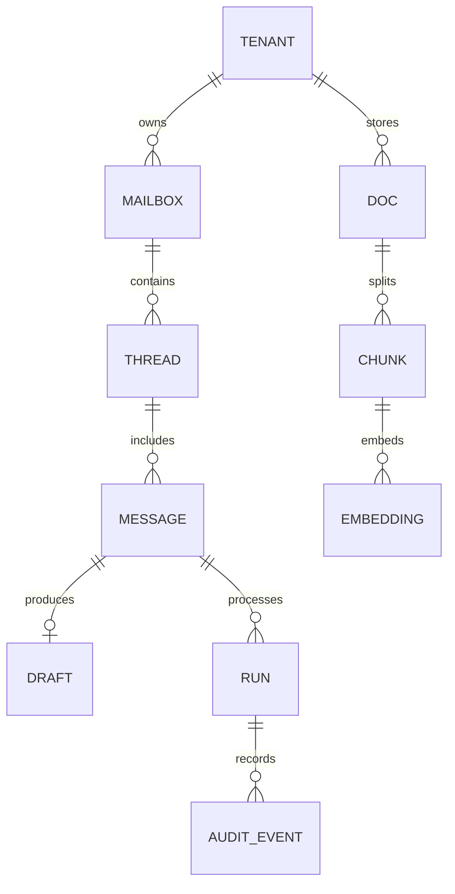

# Data Model (Phase 2)

## A) Purpose
Define the minimal canonical data model needed to support the Phase 2 pipeline in DR-0003 and the contracts in `docs/architecture/contracts.md` before writing migrations. This is a conceptual spec for entities, constraints, and retention, not an implementation.

## B) Tenancy + scoping rules (must be explicit)
- Every row is tenant-scoped (`tenant_id`) unless explicitly global.
- No cross-tenant retrieval or joins without `tenant_id` filtering.
- Designed to align with future RLS, even if not enforced in v1.

## C) Entity list (minimal set)
**tenant**
Why: Represents an operator account boundary for isolation, billing, and configuration.
- Primary key: `id` (uuid)
- Required fields: `name`, `status`
- Timestamps: `created_at`, `updated_at`

**mailbox**
Why: Represents a connected provider mailbox within a tenant.
- Primary key: `id` (uuid)
- Required fields: `tenant_id`, `provider`, `provider_mailbox_id`, `email_address`, `status`
- Provider identifiers: `provider_mailbox_id`, `email_address`
- Status fields: connection health, auth state
- Timestamps: `created_at`, `updated_at`, `last_sync_at`

**thread**
Why: Canonical representation of a provider thread for grouping messages and drafts.
- Primary key: `id` (uuid)
- Required fields: `tenant_id`, `mailbox_id`, `provider_thread_id`, `subject`
- Provider identifiers: `provider_thread_id`
- Status fields: `sync_state` (optional)
- Timestamps: `created_at`, `updated_at`, `last_message_at`

**message**
Why: Canonical inbound/outbound email message in a thread.
- Primary key: `id` (uuid)
- Required fields: `tenant_id`, `mailbox_id`, `thread_id`, `provider_message_id`, `direction`, `from`, `to`, `subject`, `sent_at`
- Provider identifiers: `provider_message_id`
- Status fields: `processing_state` (received/processing/processed/failed)
- Timestamps: `created_at`, `updated_at`

**draft**
Why: Represents a provider draft generated from a message.
- Primary key: `id` (uuid)
- Required fields: `tenant_id`, `mailbox_id`, `thread_id`, `message_id`, `provider_draft_id`, `status`
- Provider identifiers: `provider_draft_id`
- Status fields: `status` (created/updated/sent/discarded)
- Timestamps: `created_at`, `updated_at`

**doc**
Why: Tenant-provided documents used for retrieval (FAQs, policies, itineraries).
- Primary key: `id` (uuid)
- Required fields: `tenant_id`, `source`, `title`, `status`
- Status fields: `ingest_state` (pending/ready/failed)
- Timestamps: `created_at`, `updated_at`

**chunk**
Why: Normalized text chunks for retrieval and evidence grounding.
- Primary key: `id` (uuid)
- Required fields: `tenant_id`, `doc_id`, `content`, `sequence`
- Status fields: `status` (active/archived)
- Timestamps: `created_at`, `updated_at`

**embedding**
Why: Vector representations of chunks across model versions.
- Primary key: `id` (uuid)
- Required fields: `tenant_id`, `chunk_id`, `model`, `vector`
- Status fields: `status` (active/archived)
- Timestamps: `created_at`

**audit_event**
Why: Append-only audit trail of pipeline stages and outcomes.
- Primary key: `id` (uuid)
- Required fields: `tenant_id`, `run_id`, `stage`, `outcome`, `occurred_at`
- Status fields: `error_category` (nullable)
- Timestamps: `created_at`

**run** (recommended)
Why: Groups a single processing attempt across stages for correlation and auditing.
- Primary key: `id` (uuid)
- Required fields: `tenant_id`, `mailbox_id`, `thread_id`, `message_id`, `status`
- Status fields: `status` (started/completed/failed/sensitive)
- Timestamps: `created_at`, `updated_at`

## D) Relationships + cardinality
- `tenant` -> `mailbox` (1:N)
- `mailbox` -> `thread` (1:N)
- `thread` -> `message` (1:N)
- `message` -> `draft` (1:0..1) default
- `tenant` -> `doc` (1:N)
- `doc` -> `chunk` (1:N)
- `chunk` -> `embedding` (1:0..N)
- `message` -> `run` (1:N) with `run` as processing attempts
- `run` -> `audit_event` (1:N)

## E) Key constraints & indexes (most important section)
Provider mapping constraints:
- Unique mailbox per `(tenant_id, provider, provider_mailbox_id)` (or `(tenant_id, provider, email_address)`).
- Unique thread per `(tenant_id, mailbox_id, provider_thread_id)`.
- Unique message per `(tenant_id, mailbox_id, provider_message_id)`.

Idempotency constraints:
- Unique draft per `(tenant_id, mailbox_id, provider_message_id)`.
- Unique run per `(tenant_id, mailbox_id, provider_message_id, attempt)` (conceptual) or dedupe key for current attempt.

Retrieval indexes:
- Vector index on `embedding.vector` scoped by `tenant_id` (and join to `chunk_id`).
- Index on `chunk.doc_id` for evidence lookup.

Audit queries:
- Index on `(tenant_id, run_id)`.
- Index on `(tenant_id, mailbox_id, created_at)`.

## F) Retention + storage stance (v1 default)
- Postgres: store normalized message text fields, thread metadata, drafts, and audit events.
- S3: optional raw MIME and attachment bodies with short, configurable retention.
- Audit events retained longer (configurable) to answer "why did it draft this?"

## G) Mermaid ERD (optional but recommended)

## H) Mapping to pipeline
A single inbound message produces:
- `message` record (from provider notification)
- `run` record (processing attempt)
- `audit_event` records for each stage
- `draft` record when created
- `doc`/`chunk`/`embedding` referenced as evidence for the run
