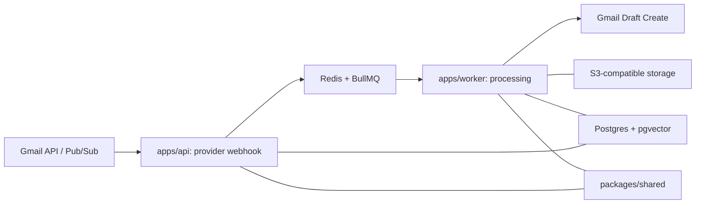

# Architecture Overview (Phase 2)

## A) Purpose / What this doc is for
This document defines system boundaries and the end-to-end event pipeline for Gmail-first drafts, and how Outlook plugs in later via MailProvider without rewrites. It is the execution reference for Phase 2 implementation steps and must stay aligned with DR-0003.
See `docs/architecture/contracts.md` for canonical contract details.

## B) System boundary diagram (Mermaid)

## C) Components and responsibilities
- `apps/api`: provider notification ingest, future auth callbacks, canonical event persistence, enqueue jobs.
- `apps/worker`: process jobs, fetch message/thread, guardrails, retrieval, AI draft generation, create provider draft.
- `packages/shared`: canonical models/contracts, provider registry types, AI wrapper DTOs.
- `Postgres + pgvector`: `tenant`, `mailbox`, `thread`, `message`, `draft`, `doc`, `chunk`, `embedding`, `audit_event`, `run`.
- `Redis + BullMQ`: durable jobs, retries, dead-letter handling.
- `S3-compatible storage`: tenant documents and derived artifacts.

## D) Canonical data flow (new email -> draft in Gmail)
1. Provider notification arrives (Gmail watch + Pub/Sub push) at `apps/api`.
2. API normalizes to canonical event, persists it before enqueue (idempotent on `(tenant_id, mailbox_id, provider_message_id)`).
3. API enqueues job; job id derived from `(tenant_id, mailbox_id, provider_message_id)`.
4. Worker claims job, fetches message and thread context via MailProvider adapter.
5. Guardrails-first classification runs before drafting; sensitive cases route to human review (no guest-ready draft by default).
6. Retrieval pulls tenant docs and evidence; if evidence confidence is low, draft asks clarifying questions instead of guessing.
7. AI wrapper creates draft content; output is validated against guardrails.
8. Worker creates a provider draft via MailProvider; default is one draft per inbound message.
9. Append-only `audit_event` records each stage with correlation IDs and evidence references.

## E) Provider abstraction: MailProvider (one-page summary)
Provider-agnostic core vs provider-specific adapters:
- Provider-agnostic core: canonical types, pipeline orchestration, guardrails, retrieval, AI wrapper usage.
- Provider-specific adapter: notification parsing, message/thread fetch, draft create, auth and rate-limit handling.

Mapping:
- Gmail now: `historyId` + watch via Pub/Sub, fetch message/thread, create Gmail draft.
- Outlook later: Graph subscriptions for notifications, fetch message/thread, create Outlook draft.

Rule: core logic never imports provider SDKs directly. Only adapter modules can import provider SDKs; core depends on MailProvider interfaces only.

## F) Guardrails and AI boundary
- Guardrails-first: sensitive detection runs before drafting.
- Evidence gating: retrieval confidence below threshold triggers clarifying questions rather than guessing.
- Drafts only in v1; never auto-send.

## G) Failure modes and handling
- Duplicate notifications: idempotent event persistence and job ids prevent duplicate drafts.
- Missed watch / history gap: API detects gap, triggers provider resync flow for mailbox.
- Auth revoked: job fails with explicit reason, mailbox marked unhealthy, operator prompted to reconnect.
- Provider rate limits: exponential backoff with bounded retries, queue visibility for operations.
- Partial thread context: proceed with available messages and record missing context in audit.
- AI failure / timeout: fallback to human review with reason; no draft created.
- Retrieval returns no evidence: create a clarifying-question draft or route to review depending on guardrails.

## H) Observability / auditability requirements
- Correlation IDs on all stages: `tenant_id`, `mailbox_id`, `thread_id`, `message_id`, `job_id`, `run_id`.
- Append-only `audit_event` per stage: ingest, enqueue, guardrails, retrieval, AI, draft create.
- All drafts link to `run` and evidence references to answer: "Why did it draft this?"

## I) Non-goals (v1) and invariants
- Non-goals: auto-send, website changes, provider-specific UI integrations outside Gmail.
- Invariants: Gmail-first drafts inside inbox, operator stays in Gmail, multi-tenant isolation, provider abstraction intact.
